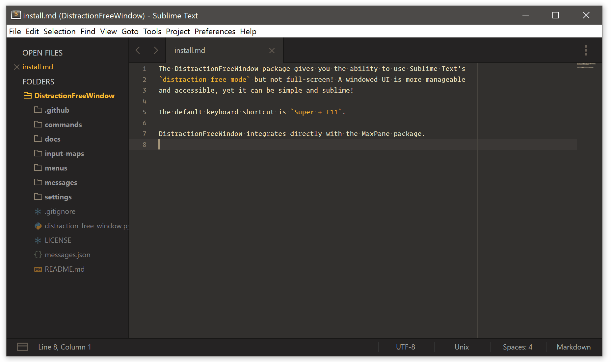

# [DistractionFreeWindow](https://packagecontrol.io/packages/DistractionFreeWindow) for SublimeText

[](https://github.com/aziz/DistractionFreeWindow/tree/master/LICENSE.md)
[](https://packagecontrol.io/packages/DistractionFreeWindow)
[](https://packagecontrol.io/packages/DistractionFreeWindow)

<br>

<p align="center">
  
</p>

<br>

> Screencast shows Gruvbox Theme & Color Scheme, Operator Mono Medium as font.

Sublime Text "Distraction free mode" but not full-screen!
A windowed UI is more manageable and accessible yet it can be simple and sublime!

Distraction free mode lets you focus on one thing and that is the code/text that you are writing.
However, you can not use it for a long time, mostly because it is like living in a cave! but once in a while you need to come out for hunting!

When writing code, you need to check the documentation.
When writing a markdown document you need to look at it in the browser.
When translating you need to look at the original source.

This plugin makes it easy to go back and forth from the left side of the image below to the right side, with just a single key (or key combination, depending on your key bindings).
The command to toggle between these two states is also available in Command Pallette.

## Installation

### Package Control

1. Install the [Package Control plugin](https://packagecontrol.io/installation).
2. Within Sublime Text, bring up the **Command Palette** and choose **Package Control: Install Package** command.
3. Select `Distraction Free Window`.

### Manual installation

Drop the entire folder in Sublime's `Packages` folder.
You can do this using `git clone`:

```bash
    $ cd .../Packages  # Whatever the location is
    $ git clone git://github.com/aziz/DistractionFreeWindow.git
```

Or download the files using the GitHub .zip download option and unzip the files to your Sublime Text Packages directory.
Make sure the folder name is `DistractionFreeWindow`.

## Usage

By default this plugin hides **tabs**, **status bar**, **side bar** and **minimap**. You can override the default by changing the settings in your user specific settings.
Go to `Preferences > Package Settings > Distraction Free Window > Settings – User` and change the settings by copying them from the default settings file (or below) and changing them.
You can also hide **line numbers**, **fold buttons**, **the whole gutter**.
You can **center the text** and configure the width.

### Changing Layout

If you have [MaxPane Plugin](https://sublime.wbond.net/packages/MaxPane) installed, this plugin will automatically use it and simplify the layout when you go to DistractionFreeWindow mode and restore the layout after comming out of it.

## Settings

``` javascript
{
  "dfw_hide_tabs": true,
  "dfw_hide_status_bar": true,
  "dfw_hide_minimap": true,
  "dfw_hide_side_bar": true,

  "dfw_hide_rulers": true,
  "dfw_hide_indent_guides": true,
  "dfw_hide_white_space": true,
  "dfw_hide_line_numbers": false,
  "dfw_hide_fold_buttons": false,
  "dfw_hide_gutter": false,

  // Be sure to set dfw_wrap_width when dfw_draw_centered is true
  "dfw_draw_centered": false,
  "dfw_wrap_width": 90,

  // Changing layout depends on `MaxPane` package
  // Install it via package control:
  // https://sublime.wbond.net/packages/MaxPane
  "dfw_switch_to_single_layout": true
}
```

## Key Bindings

The default keyboard bindings use the <kbd>Super</kbd>+<kbd>F11</kbd> key for toggling into and out of DistractionFreeWindow mode.

You can customize it by copying the below code into you User Key Bindings file (Preferences > Key Bindings) and changing the shortcut.

``` javascript
    { "keys": ["super+f11"], "command": "distraction_free_window" }
```

### Inspiration

[This post](http://www.sublimetext.com/forum/viewtopic.php?f=4&t=15118) on the SublimeText forum.

## License

DistractionFreeWindow plugin is released under the MIT license. See LICENSE file.
Copyright (c) 2016 ([Allen Bargi](https://github.com/aziz))
